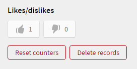

# Setup

## Css

If you don't have an own css file, add the following code to your `header.php` snippet:

```php
echo css('assets/plugins/kirby-nja/css/style.min.css');
```

**The `nja-loading` class**

By default the class `nja-loading` is not used, but if you want a loading indicator of some kind you can use this class.

## Javascript

Add the following code to your `footer.php` snippet:

```php
<?php echo js('assets/plugins/kirby-nja/js/dist/script.min.js'); ?>
<script>
nja.init({root: '<?php echo u(); ?>'});
</script>
```

### Options

```js
nja.init({
  root: '<?php echo u(); ?>',
  timeout: 4000,
  ajaxCallback: function(item, group, args) {
    console.log(args);
  }
});
```

#### `timeout`

When a button is clicked it will be active right away. Later it checks if the request has been complete. If it has not it will fall back to not be active anymore. You can set a timeout value for that.

#### `ajaxCallback`

If you need to do something when the like/dislike is saved you can use a callback.

- `group` is the button group object.
- `item` is the clicked button object.
- `args` is an array with data. Use the `console.log` to see what it contains.

## Snippet

Use the built in snippet or build you own. The built in snippet can be disabled by an option, or overwritten by your own with the same name.

```php
snippet('nja');
```

Or with all the optional arguments:

```php
snippet('nja', array(
  'page' => $page,
  'likeButton' => true,
  'dislikeButton' => true
));
```

If the optional arguments are not set `likeButton` and `dislikeButton` will fallback to their [options](docs/options.md).

## Blueprint (optional)

If you want to see the votes in the panel you can add this to your blueprint:

```text
fields:
  nja:
    title: Likes/dislikes
    type: nja
```

